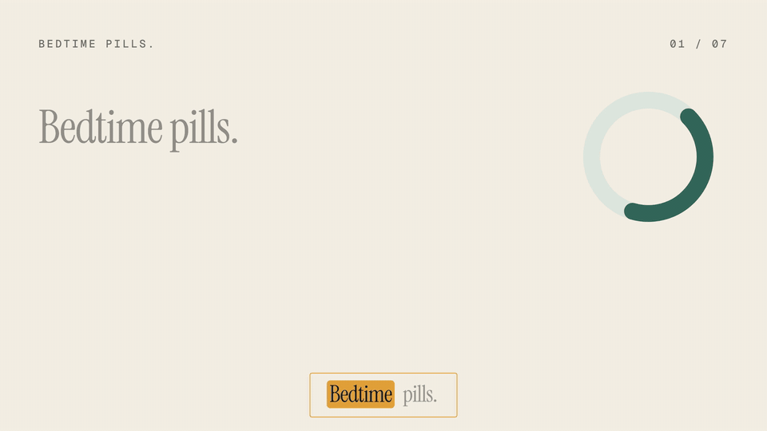
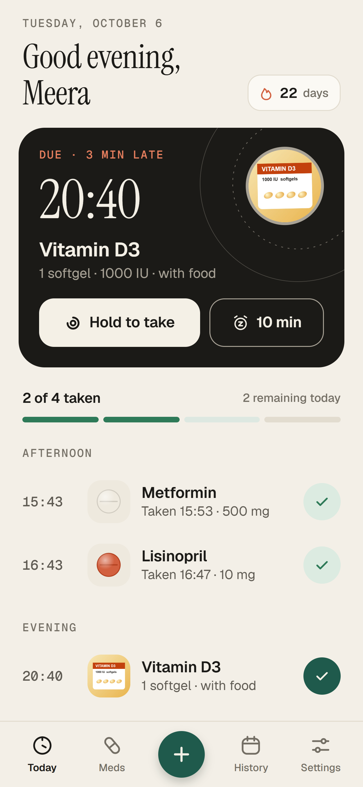
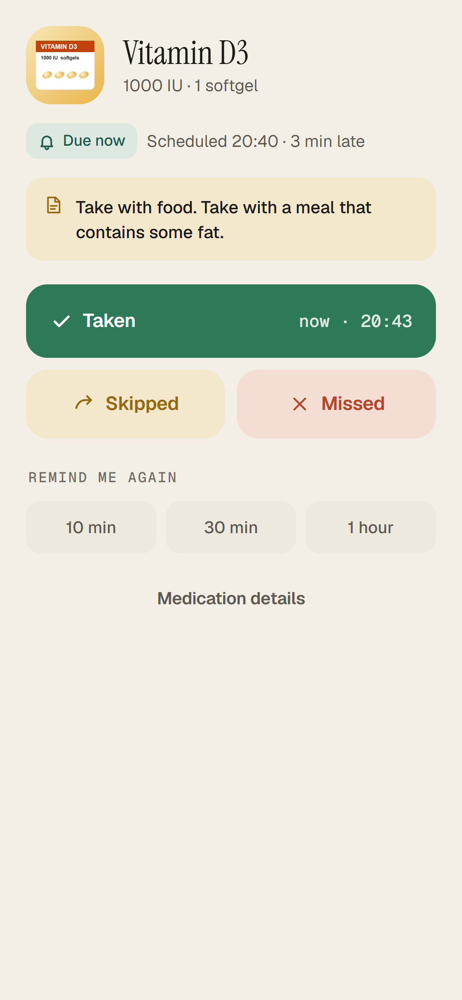
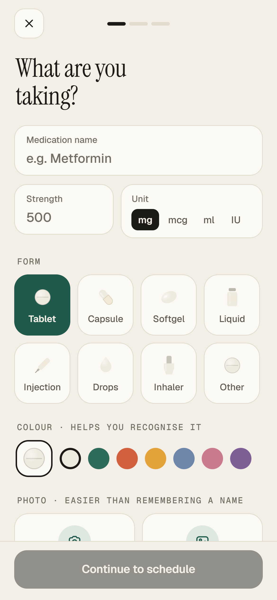
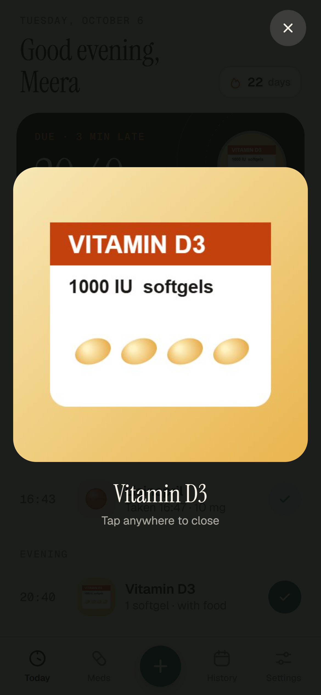
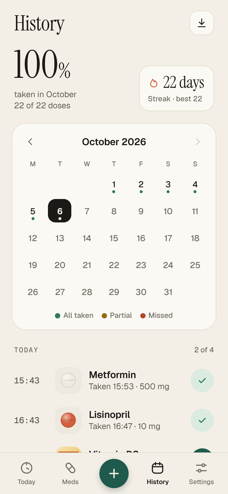
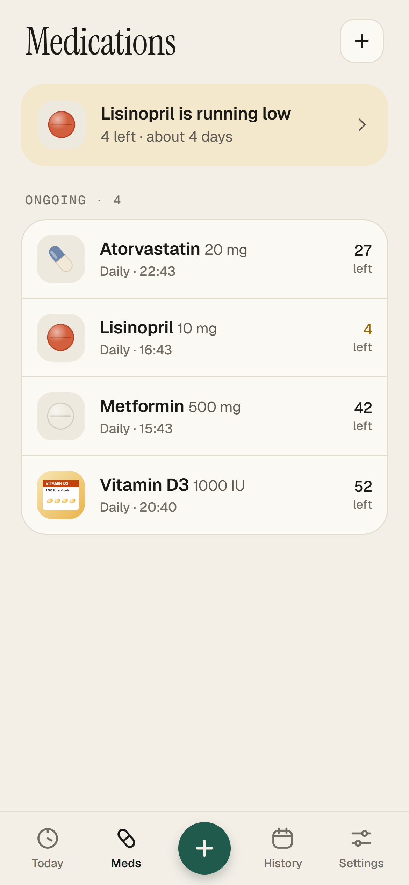
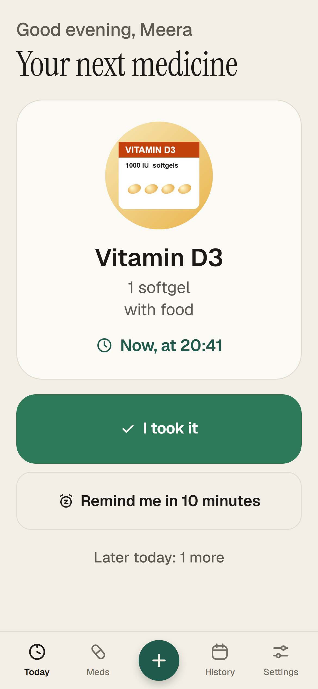
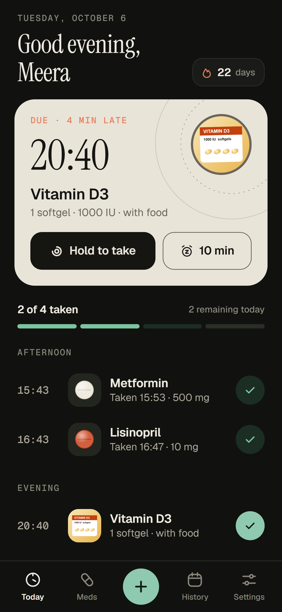

<div align="center">


### Every dose, kept.

A calm, private medication reminder for iPhone and Android.
No account. No cloud. Works completely offline.

[](https://github.com/cbharshainfinity07/Tend-Medi/actions/workflows/ci.yml)




[Watch the full promo (1080p)](docs/media/tend-promo-1080p.mp4)

</div>

---

## Screens

<table>
  <tr>
    <td align="center"><br /><sub>Today</sub></td>
    <td align="center"><br /><sub>Reminder</sub></td>
    <td align="center"><br /><sub>Add a medicine</sub></td>
    <td align="center"><br /><sub>Medicine photo</sub></td>
  </tr>
  <tr>
    <td align="center"><br /><sub>History and streaks</sub></td>
    <td align="center"><br /><sub>Medicines</sub></td>
    <td align="center"><br /><sub>Simple mode</sub></td>
    <td align="center"><br /><sub>Dark mode</sub></td>
  </tr>
</table>

## Features

| | |
|---|---|
| **Reminders on the minute** | Local notifications on a rolling 7-day plan, with a gentle follow-up if a dose isn't marked. Taken, Snooze or Skip right from the notification. |
| **Any schedule** | Daily, every few hours, specific weekdays, every few days, or as needed, with optional start and end dates. |
| **Know every medicine on sight** | Photograph the tablet, strip or box. The photo appears on Today, on reminders and full screen with one tap, which helps anyone who struggles with medicine names. |
| **Hold to take** | A satisfying press-and-hold with haptics and a small celebration. Screen-reader users get a normal tap. |
| **History** | Taken, skipped and missed doses, adherence, streaks and a month calendar, plus a CSV report for your doctor. |
| **Refills and notes** | Track pills left and get a nudge before you run out. Notes on every medicine. |
| **Built for every age** | Simple mode with bigger text and buttons, Dynamic Type, screen-reader labels, Reduce Motion, WCAG AA contrast, light and dark themes. |
| **Yours alone** | No account, no server, no analytics. Back up and restore through the phone's Files app. Android release builds don't even request internet access. |

## Download

Builds are made in the cloud with [EAS Build](https://expo.dev/accounts/cbharsha200/projects/tend/builds).

- **Android:** open the latest **preview** build on the builds page and install the `.apk` on your phone. The **production** build is the `.aab` for Google Play.
- **iPhone:** installing on a real iPhone needs an Apple Developer account. Until then, run it in **Expo Go** (below) or use the iOS Simulator build.

## Run it locally

```bash
npm install
npm start          # scan the QR code with Expo Go (Android) or the Camera app (iPhone)
npm run tunnel     # if the phone and the computer are on different networks
```

## Build with EAS

```bash
npx eas-cli build --platform android --profile preview      # installable APK
npx eas-cli build --platform android --profile production   # Play Store bundle (AAB)
npx eas-cli build --platform ios --profile production       # App Store (needs an Apple Developer account)
```

You can also start a build from GitHub: **Actions → EAS Build → Run workflow**. This needs an `EXPO_TOKEN` repository secret (create one at expo.dev → Account settings → Access tokens).

## Checks

```bash
npm test           # scheduling, streaks, reminder planning and backup
npm run typecheck
npm run lint
```

All three run on every push through GitHub Actions.

## Project structure

| Path | What it does |
|---|---|
| `src/app/` | Expo Router screens: onboarding, Today, Meds, History, Settings, add/edit wizard, dose sheet, medicine detail |
| `src/domain/` | Pure logic: schedules, dose states (due, missed, taken), adherence, streaks |
| `src/data/` | Storage: SQLite on the phone, localStorage for the web preview |
| `src/store/` | Zustand store; every change is saved and reminders are re-planned |
| `src/notifications/` | Rolling reminder plan (at most 60 pending, under the iOS limit), follow-ups, snooze, notification actions |
| `src/photos/` | Medicine photos: camera and library, stored in the app's private folder |
| `src/backup/` | Backup and restore (including photos), CSV report |
| `src/ui/` | Design system: tokens, type, icons, pill glyphs, motion and haptics |
| `brand/` | Logo, app icon and splash sources (SVG) and exports (PNG) |
| `docs/` | Release guides, store listing, privacy policy, screenshots, promo video |

## Expo Go vs. a real build

Everything core works in Expo Go: reminders, notification actions, storage, photos, backup and restore.
These only work in an EAS build:

- Android handling of reminder buttons while the app is fully closed
- iOS time-sensitive notifications
- Removing the Android internet permission (`TEND_BLOCK_INTERNET=1` in release profiles)

## Docs

- [Production readiness report](docs/PRODUCTION-READINESS.md)
- [Android release guide](docs/README-ANDROID.md)
- [iOS release guide](docs/README-IOS.md)
- [Store listing](docs/STORE-LISTING.md)
- [Privacy policy](docs/PRIVACY-POLICY.md)

## Medical disclaimer

Tend is a reminder tool and does not give medical advice. Always follow your doctor's or pharmacist's instructions.

## License

[MIT](LICENSE)
